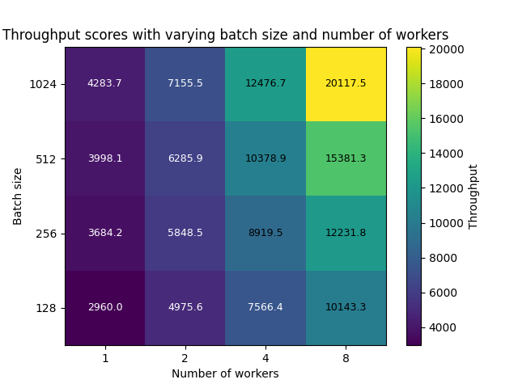

# Distributed AI Training System (Synchronous SGD)
This project implements a distributed machine learning training system based on synchronous stochastic gradient descent (SGD) using a parameter-server architecture. The system is designed to be model-agnostic, supporting arbitrary PyTorch models without requiring model code on the server.

The primary goal is to explore ML systems design trade-offs, including synchronisation, communication overhead, and scalability.

## System Overview
The system consists of:

- $1$ Parameter Server -
Maintains the canonical model parameters, aggregates gradients, applies SGD updates, and coordinates synchronisation.

- $N$ Worker Processes - 
Each worker holds a local PyTorch model, processes a disjoint shard of the dataset, computes gradients, and communicates with the PS over TCP sockets. All behaviour around computing gradients and loading shards of training data are encapsulated in the `WorkerModel` class in `worker_model.py`.

Training proceeds in step-based synchronous iterations:
 1. The parameter server (PS) sends parameters to all workers
 2. The workers compute gradients using the parameters given and a disjoint mini-batch of training data, and send them back to the PS.
 3. The PS waits for all workers to send gradients, aggregates them and applies gradient descent on the parameters.

## Key Design Features

- **Synchronous SGD**

    The PS enforces a strict barrier at each training step, ensuring all gradients are computed using the same parameter version.

- **Model-Agnostic Runtime**

  Parameters and gradients are exchanged as named tensors (`{parameter_name -> tensor}`), allowing the system to support any PyTorch model without server-side model definitions.

- **Explicit Communication Protocol**

    Workers and PS communicate via a TCP sockets with length-prefixed messages.

## Running the system

1. For each of $N$ workers, run `python worker.py <num-workers> <worker-id>` where `worker-id` is in the range $[0, N - 1]$, in a separate terminal. 
2. In a separate terminal, run `python server.py <num-workers>`.

The number of training steps, worker batch size and the path to which finalised parameters are exported can be customised in `common.py`

## Scope and Limitations

- Supports parameter-only models.
- Designed for research and experimentation, not production deployment.

## Throughput benchmarking
I used the following formula to get a throughput score for the system:
$$S=\frac{NB}{T_{step}}$$
where $N$ is the number of workers, $B$ is the mini-batch size, $T_{step}$ is the average time taken per training step in seconds.

Across all tests, all workers use the same `WorkerMNistModel` given in `mnist_model.py` and the number of training steps on the parameter server is set to $64$.

#### Results
